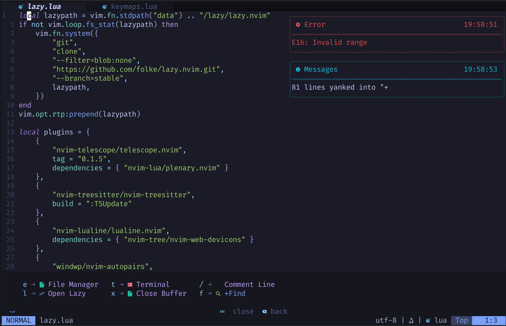

# nvim-config

**This is my personal Neovim config. I know that there are many other completed configs like AstroNvim, NvChad and etc. but I decided to make my own. For me it is a good coding experience combined with ideal config which has everything I need and nothing extra.**

## 🌟 Preview

<a href="https://github.com/kanipov/nvim-config/tree/main/img">See more...</a>

## ✨ Features
- Modern plugin manager <a href="https://github.com/folke/lazy.nvim">lazy.nvim</a>
- File explorer with <a href="https://github.com/nvim-tree/nvim-tree.lua">nvim-tree.lua</a>
- Fast file and text finder with <a href="https://github.com/nvim-telescope/telescope.nvim">telescope.nvim</a>
- Terminal with <a href="https://github.com/akinsho/toggleterm.nvim">toggleterm.nvim</a>
- Syntax highlight with <a href="https://github.com/nvim-treesitter/nvim-treesitter">nvim-treesitter</a>
- Beautiful messages with <a href="https://github.com/folke/noice.nvim">noice.nvim</a>
- Multitabs with <a href="https://github.com/akinsho/bufferline.nvim">bufferline.nvim</a>
- Minimalistic start screen with <a href="https://github.com/nvimdev/dashboard-nvim">dashboard-nvim</a>
- Custom status bar with <a href="https://github.com/nvim-lualine/lualine.nvim">lualine.nvim</a>
- Keymaps helper with <a href="https://github.com/folke/which-key.nvim">which-key.nvim</a>
- Fast comments with <a href="https://github.com/terrortylor/nvim-comment">nvim-comment</a>
- Autopair brackets with <a href="https://github.com/windwp/nvim-autopairs">nvim-autopairs</a>

## ⚡️ Requirements
- <a href="https://neovim.io">Neovim</a> (needs to be built with LuaJIT)
- <a href="https://www.nerdfonts.com">Nerd Font</a> (optional)
- <a href="https://git-scm.com">Git</a> (for cloning repository)
- <a href="https://iterm2.com">iTerm2</a> (if you use macOS)
- <a href="https://github.com/BurntSushi/ripgrep">ripgrep</a> and <a href="https://github.com/sharkdp/fd">fd</a>

## 🛠️ Installation
See <a href="https://github.com/kanipov/nvim-config/blob/main/doc/installation.txt">installation steps</a> for macOS
